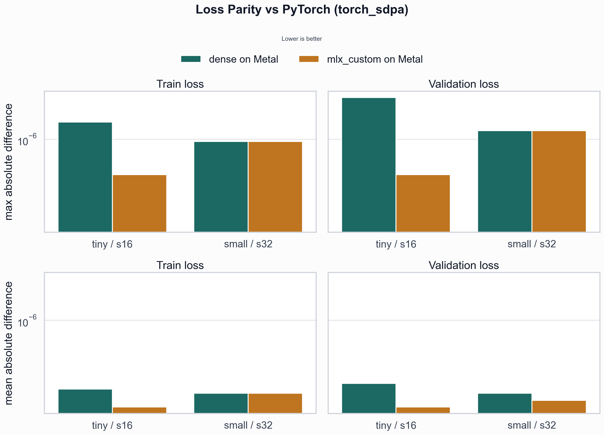
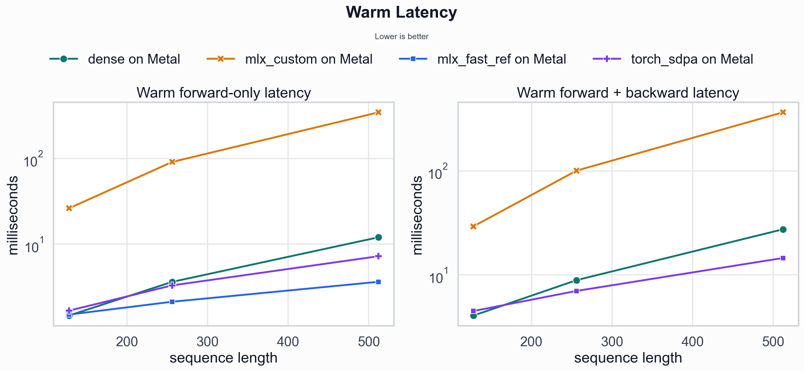
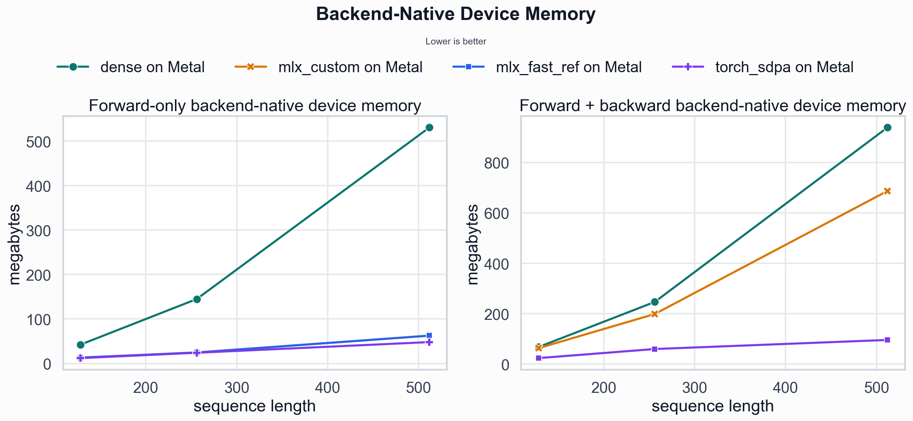

# Attention Implementation Comparisons

## 1. Description

We're trying to implement a custom kernel (`ScaledDotProductAttentionMLXCustom` in `autograd/functional.py`) for the attention mechanism. This document reports experiments validating a custom attention kernel, focusing on correctness parity and performance differences (memory and throughput) across implementations.

All reported runs use float32 causal self-attention. Benchmark runs use `dropout=0`. Loss parity uses synthetic GPT-2 training with identical initial weights and batches within each round, isolating backend differences to the attention implementation rather than initialization or data drift.

## 2. Implementation Definitions

These names appear in the tables and figures below.

- `dense`: baseline attention implementation that materializes the dense score/probability path, supports training and backward, and uses this repository’s Tensor library.
- `mlx_fast_reference`: thin wrapper around MLX’s built-in [`mlx.core.fast.scaled_dot_product_attention`](https://ml-explore.github.io/mlx/build/html/python/_autosummary/mlx.core.fast.scaled_dot_product_attention.html); used here only for forward-only benchmarking.
- `mlx_custom`: repository-owned fused MLX/Metal causal attention kernel with a custom forward path and explicit backward implementation.
- [`torch_sdpa`](https://docs.pytorch.org/docs/stable/generated/torch.nn.functional.scaled_dot_product_attention.html): PyTorch’s built-in `torch.nn.functional.scaled_dot_product_attention`; used as the external correctness and performance reference.

All experiments were run on an Apple M2 Max (Metal backend).

## 3. Loss Parity Between Implementations

PyTorch [`torch_sdpa`](https://docs.pytorch.org/docs/stable/generated/torch.nn.functional.scaled_dot_product_attention.html) is used as the reference implementation for loss parity.

### Model configs (for loss parity)

| vocab_size | hidden_size | num_heads | seq_len | num_layers | batch_size | train_steps | val_steps/checkpoint | lr | beta2 | weight_decay | max_grad_norm | adam_epsilon | label_smoothing |
| --- | --- | --- | --- | --- | --- | --- | --- | --- | --- | --- | --- | --- | --- |
| 257 | 32 | 4 | 16 | 2 | 4 | 8 | 2 | 0.001 | 0.99 | 0.1 | 1.0 | 1e-07 | 0.1 |
| 257 | 64 | 4 | 32 | 2 | 4 | 6 | 2 | 0.001 | 0.99 | 0.1 | 1.0 | 1e-07 | 0.1 |

**Takeaway:** `dense` and `mlx_custom` match `torch_sdpa` loss to within ~1e-6, confirming numerical correctness.

Each backend begins from the same reference GPT-2 weights, processes the same synthetic token stream, and uses identical train/validation offsets within a round. The controller executes different attention implementations sequentially, while the execution order is randomized across rounds. For reporting, each backend’s loss delta is computed against the [`torch_sdpa`](https://docs.pytorch.org/docs/stable/generated/torch.nn.functional.scaled_dot_product_attention.html) run from the same seed.

Parity was measured over 4 rounds with randomized execution order. The full table appears in the appendix. Across 4 seeds and 2 model configurations, all train and validation loss deltas are extremely small: the largest absolute delta is `2.3842e-6`, and all mean absolute deltas are ≤ `2.682e-7`. Under these configurations, both dense and mlx_custom are effectively loss-identical to the [`torch_sdpa`](https://docs.pytorch.org/docs/stable/generated/torch.nn.functional.scaled_dot_product_attention.html) reference.

## 4. Memory and Speed Comparison

### Model configs (for performance benchmarks)

| sequence length | batch_size | num_heads | head_dim |
| --- | --- | --- | --- | --- |
| 128 | 8 | 12 | 64 |
| 256 | 8 | 12 | 64 |
| 512 | 8 | 12 | 64 |

**Takeaway:** `mlx_custom` reduces memory but is currently slower than both `dense` and `torch_sdpa`. This will be something to tackle as a next task later.

Note: `mlx_fast_reference` appears only in the forward-only benchmark because the repository implementation does not support backward. The forward + backward tables therefore compare only `dense`, `mlx_custom`, and `torch_sdpa`.

Metrics:
- `cold_mean`: first execution after allocator/cache reset for that worker run.
- `warm_mean`, `warm_p50`, `warm_p90`: summary statistics over repeated post-warmup iterations.
- `warm_forward_mean`, `warm_backward_mean`: forward and backward components of the warm forward + backward measurement.
- `rss_peak_delta_mb`: host RSS increase during the measured window.
- `device_active_peak_delta_mb`, `device_cache_peak_delta_mb`, `device_peak_delta_mb`: MLX device memory deltas.
- `device_allocated_peak_delta_mb`, `device_driver_peak_delta_mb`: PyTorch device memory deltas.

MLX and PyTorch expose different memory counters, so cross-framework memory comparisons require caution. The MLX columns are directly comparable across MLX backends (`dense`, `mlx_custom`, `mlx_fast_reference`). On the PyTorch side, `device_allocated_peak_delta_mb` reflects steady-state usage, while large cold `device_driver_peak_delta_mb` values likely include one-time runtime initialization.

## Appendix

This appendix contains the detailed experiment configuration and raw measurement tables referenced in the main report.

### Experiment Setup Details

| reported run | warmup_iters | benchmark_iters | execution | seed policy |
| --- | --- | --- | --- | --- |
| loss parity | N/A | N/A | sequential execution; backend order rotated each round | 1337-1340 (one seed per round) |
| performance benchmark | 2 | 5 | sequential worker runs with allocator reset between measurements | worker seed derived from tensor shape and round |

### Loss parity table (vs torch_sdpa)

| config | backend | seeds | train_steps | val_steps/checkpoint | train_max_abs_diff | train_mean_abs_diff | train_last_abs_diff | val_max_abs_diff | val_mean_abs_diff | val_last_abs_diff |
| --- | --- | --- | --- | --- | --- | --- | --- | --- | --- | --- |
| gpt2_tiny_s16 | dense | 1337/1338/1339/1340 | 8 | 2 | 1.4305e-6 | 2.384e-7 | 0.0e+0 | 2.3842e-6 | 2.682e-7 | 0.0e+0 |
| gpt2_tiny_s16 | mlx_custom | 1337/1338/1339/1340 | 8 | 2 | 4.768e-7 | 1.639e-7 | 0.0e+0 | 4.768e-7 | 1.639e-7 | 0.0e+0 |
| gpt2_small_s32 | dense | 1337/1338/1339/1340 | 6 | 2 | 9.537e-7 | 2.186e-7 | 4.768e-7 | 1.1921e-6 | 2.186e-7 | 2.384e-7 |
| gpt2_small_s32 | mlx_custom | 1337/1338/1339/1340 | 6 | 2 | 9.537e-7 | 2.186e-7 | 4.768e-7 | 1.1921e-6 | 1.887e-7 | 2.384e-7 |

### Forward-only latency (ms)

| sequence length | backend | cold_mean | warm_mean | warm_p50 | warm_p90 |
| --- | --- | --- | --- | --- | --- |
| 128 | dense | 23.422 | 1.464 | 1.617 | 1.673 |
| 128 | mlx_custom | 61.847 | 26.257 | 26.030 | 28.142 |
| 128 | mlx_fast_reference | 28.767 | 1.503 | 1.505 | 1.607 |
| 128 | torch_sdpa | 33.822 | 1.671 | 1.707 | 2.037 |
| 256 | dense | 18.501 | 3.624 | 3.473 | 4.164 |
| 256 | mlx_custom | 129.972 | 91.323 | 91.666 | 91.837 |
| 256 | mlx_fast_reference | 21.332 | 2.124 | 2.005 | 2.493 |
| 256 | torch_sdpa | 101.676 | 3.297 | 3.332 | 3.759 |
| 512 | dense | 38.344 | 12.029 | 12.136 | 12.529 |
| 512 | mlx_custom | 382.722 | 347.254 | 347.730 | 349.512 |
| 512 | mlx_fast_reference | 25.880 | 3.632 | 3.550 | 4.113 |
| 512 | torch_sdpa | 46.503 | 7.231 | 7.264 | 7.970 |

### Forward-only warm-memory

| sequence length | backend | rss_peak_delta_mb (host) | device_active_peak_delta_mb | device_cache_peak_delta_mb | device_peak_delta_mb | device_allocated_peak_delta_mb | device_driver_peak_delta_mb |
| --- | --- | --- | --- | --- | --- | --- | --- |
| 128 | dense | 11.262 | 36.063 | 6.110 | 42.235 | N/A | N/A |
| 128 | mlx_custom | 3.777 | 12.000 | 1.596 | 12.063 | N/A | N/A |
| 128 | mlx_fast_reference | 3.820 | 12.000 | 1.596 | 13.219 | N/A | N/A |
| 128 | torch_sdpa | 0.022 | N/A | N/A | N/A | 12.000 | 0.000 |
| 256 | dense | 22.515 | 120.250 | 24.252 | 144.752 | N/A | N/A |
| 256 | mlx_custom | 6.362 | 24.000 | 0.379 | 24.629 | N/A | N/A |
| 256 | mlx_fast_reference | 7.545 | 24.000 | 3.347 | 24.629 | N/A | N/A |
| 256 | torch_sdpa | 0.013 | N/A | N/A | N/A | 24.000 | 0.000 |
| 512 | dense | 48.038 | 433.000 | 96.629 | 530.629 | N/A | N/A |
| 512 | mlx_custom | 15.045 | 48.000 | 25.508 | 62.508 | N/A | N/A |
| 512 | mlx_fast_reference | 15.180 | 48.000 | 25.508 | 62.508 | N/A | N/A |
| 512 | torch_sdpa | 0.005 | N/A | N/A | N/A | 48.000 | 0.000 |

### Forward-only cold-memory

Large `device_driver_peak_delta_mb` values for torch_sdpa include PyTorch runtime initialization overhead during the first execution.

| sequence length | backend | rss_peak_delta_mb (host) | device_active_peak_delta_mb | device_cache_peak_delta_mb | device_peak_delta_mb | device_allocated_peak_delta_mb | device_driver_peak_delta_mb |
| --- | --- | --- | --- | --- | --- | --- | --- |
| 128 | dense | 11.092 | 36.125 | 6.110 | 42.235 | N/A | N/A |
| 128 | mlx_custom | 10.867 | 12.062 | 1.596 | 12.063 | N/A | N/A |
| 128 | mlx_fast_reference | 10.645 | 12.062 | 1.596 | 12.063 | N/A | N/A |
| 128 | torch_sdpa | 9.418 | N/A | N/A | N/A | 12.000 | 46.047 |
| 256 | dense | 20.017 | 120.500 | 24.252 | 144.752 | N/A | N/A |
| 256 | mlx_custom | 19.830 | 24.250 | 0.379 | 24.629 | N/A | N/A |
| 256 | mlx_fast_reference | 19.797 | 24.250 | 0.379 | 24.629 | N/A | N/A |
| 256 | torch_sdpa | 9.398 | N/A | N/A | N/A | 24.000 | 1106.094 |
| 512 | dense | 38.455 | 434.000 | 96.629 | 530.629 | N/A | N/A |
| 512 | mlx_custom | 37.812 | 49.000 | 25.508 | 62.508 | N/A | N/A |
| 512 | mlx_fast_reference | 37.755 | 49.000 | 25.508 | 62.508 | N/A | N/A |
| 512 | torch_sdpa | 9.655 | N/A | N/A | N/A | 48.000 | 1218.281 |

### Forward + backward latency (ms)

| sequence length | backend | cold_mean | warm_mean | warm_p50 | warm_p90 | warm_forward_mean | warm_backward_mean |
| --- | --- | --- | --- | --- | --- | --- | --- |
| 128 | dense | 19.444 | 4.060 | 4.133 | 4.165 | 2.176 | 1.884 |
| 128 | mlx_custom | 58.458 | 29.342 | 29.413 | 30.238 | 25.575 | 3.768 |
| 128 | torch_sdpa | 127.431 | 4.491 | 4.812 | 5.191 | 2.758 | 1.734 |
| 256 | dense | 27.609 | 8.901 | 8.951 | 9.604 | 5.060 | 3.840 |
| 256 | mlx_custom | 141.262 | 100.892 | 100.882 | 102.277 | 90.737 | 10.154 |
| 256 | torch_sdpa | 168.283 | 7.013 | 7.171 | 7.897 | 4.232 | 2.781 |
| 512 | dense | 67.872 | 27.467 | 27.280 | 28.320 | 17.587 | 9.880 |
| 512 | mlx_custom | 427.401 | 366.722 | 366.540 | 368.637 | 343.524 | 23.198 |
| 512 | torch_sdpa | 121.890 | 14.539 | 14.734 | 15.110 | 8.237 | 6.302 |

| backend    | warm_mean | speedup_vs_dense |
| ---------- | ------------ | ---------------- |
| dense      | 1.464        | 1.00x            |
| mlx_custom | 26.257       | 0.056x           |

### Forward + backward warm-memory

| sequence length | backend | rss_peak_delta_mb | device_active_peak_delta_mb | device_cache_peak_delta_mb | device_peak_delta_mb | device_allocated_peak_delta_mb | device_driver_peak_delta_mb |
| --- | --- | --- | --- | --- | --- | --- | --- |
| 128 | dense | 22.523 | 18.000 | 64.673 | 67.735 | N/A | N/A |
| 128 | mlx_custom | 19.555 | 18.000 | 46.736 | 63.282 | N/A | N/A |
| 128 | torch_sdpa | 0.005 | N/A | N/A | N/A | 24.000 | 0.000 |
| 256 | dense | 45.017 | 36.000 | 234.502 | 246.752 | N/A | N/A |
| 256 | mlx_custom | 33.233 | 36.000 | 162.660 | 198.846 | N/A | N/A |
| 256 | torch_sdpa | 0.000 | N/A | N/A | N/A | 60.000 | 0.000 |
| 512 | dense | 108.082 | 72.000 | 925.629 | 938.629 | N/A | N/A |
| 512 | mlx_custom | 108.210 | 72.000 | 638.070 | 686.816 | N/A | N/A |
| 512 | torch_sdpa | 0.015 | N/A | N/A | N/A | 96.000 | 0.000 |

### Forward + backward cold-memory

| sequence length | backend | rss_peak_delta_mb | device_active_peak_delta_mb | device_cache_peak_delta_mb | device_peak_delta_mb | device_allocated_peak_delta_mb | device_driver_peak_delta_mb |
| --- | --- | --- | --- | --- | --- | --- | --- |
| 128 | dense | 11.475 | 18.062 | 64.673 | 67.735 | N/A | N/A |
| 128 | mlx_custom | 11.508 | 18.062 | 46.736 | 63.282 | N/A | N/A |
| 128 | torch_sdpa | 49.972 | N/A | N/A | N/A | 24.000 | 96.281 |
| 256 | dense | 20.620 | 36.250 | 234.502 | 246.752 | N/A | N/A |
| 256 | mlx_custom | 20.617 | 36.250 | 162.660 | 198.846 | N/A | N/A |
| 256 | torch_sdpa | 50.062 | N/A | N/A | N/A | 60.000 | 1112.281 |
| 512 | dense | 39.265 | 73.000 | 925.629 | 938.629 | N/A | N/A |
| 512 | mlx_custom | 39.502 | 73.000 | 638.070 | 686.816 | N/A | N/A |
| 512 | torch_sdpa | 50.080 | N/A | N/A | N/A | 96.000 | 1158.281 |
